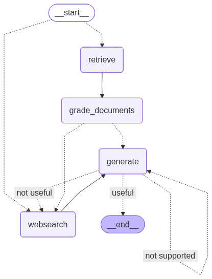
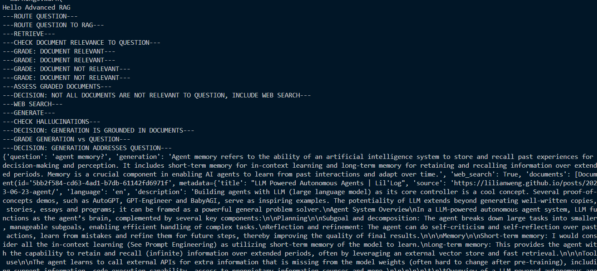

# Agentic RAG with LangGraph 🚀

This project demonstrates an **Agentic RAG (Retrieval-Augmented Generation)** workflow built with **LangGraph**.  
It chains together multiple reasoning nodes (retrieval, grading, planning, answering, etc.) into a **directed graph** where the LLM can decide how to proceed based on intermediate results.

---

## ✨ Features

- **LangGraph-based orchestration** of RAG pipeline.
- **Agentic workflow** — the LLM reflects and decides next steps instead of a fixed chain.
- **Custom nodes** for:
  - 🔍 Document retrieval
  - 📝 Answer generation
  - 🛠️ Document grading & routing
  - 🧭 Planning and query transformation
- **Extensible** — add your own nodes as callable functions.

---

## 📚 RAG Variants

### 🔄 Corrective RAG (CRAG)

CRAG introduces a **grading step** for retrieved documents.  
If documents are irrelevant or low-quality, the retriever is asked to refine and fetch better results before answering.

### 🧠 Self-RAG

Self-RAG extends RAG by letting the LLM **reflect on its own answer quality**.  
The model can decide to re-query, add missing context, or improve its response iteratively.

### ⚖️ Adaptive RAG

Adaptive RAG dynamically **chooses the best RAG strategy** (basic retrieval, corrective loop, or self-reflection) depending on the query type and context.  
This ensures a balance between efficiency and quality.

---

## 📂 Project Structure

```
agentic_rag/
│── graph/
│   ├── graph.py            # Builds the workflow graph
│   ├── state.py            # Defines shared state schema
│   └── nodes/              # Node implementations
│       ├── retrieve.py
│       ├── grade_documents.py
│       ├── answer.py
│       ├── plan.py
│       ├── transform_query.py
│       ├── route_documents.py
│       └── decide_to_generate.py
│── ingestion.py            # Retriever setup (Pinecone / Chroma / etc.)
│── main.py                 # App entrypoint
│── requirements.txt
└── README.md
```

---

## ⚙️ Setup

### 1. Clone the repo

```bash
git clone https://github.com/yourname/agentic_rag.git
cd agentic_rag
```

### 2. Create virtual environment

```bash
python -m venv .venv
source .venv/bin/activate   # macOS/Linux
.venv\Scripts\activate      # Windows
```

### 3. Install dependencies

```bash
pip install -r requirements.txt
```

### 4. Environment variables

Create a `.env` file in the project root:

```env
OPENAI_API_KEY=your_api_key
PINECONE_API_KEY=your_pinecone_key
PINECONE_ENV=your_env
USER_AGENT=agentic-rag/0.1
```

---

## ▶️ Running the App

```bash
python main.py
```

Example output:

```
---RETRIEVE---
---GRADE_DOCUMENTS---
---PLAN---
---ANSWER---
```

The graph executes dynamically based on the conversation state.

---

## 🖇️ Graph Visualization

LangGraph can render the workflow:

```python
graph.get_graph().draw_mermaid_png("graph.png")
```

### Graph Example:



### Output:



---

## ✅ Important Notes

- Each node must be a **callable function or Runnable**, not a module.  
  Example:

  ```python
  # Good
  from graph.nodes.retrieve import retrieve
  workflow.add_node("RETRIEVE", retrieve)

  # Bad
  from graph import retrieve   # ← module, causes TypeError
  ```

- Models like `gpt-3.5-turbo` don’t support JSON Schema structured outputs.  
  Use `method="function_calling"` or switch to `gpt-4o-mini`/`gpt-4.1`.

---

## 🔮 Next Steps

- Add **Reflexion** loop for self-improvement.
- Plug in **custom retrievers** (e.g., Tavily, Elasticsearch).
- Extend with **tool use** (web search, calculators, APIs).

---

## 📜 License

MIT License © 2025
